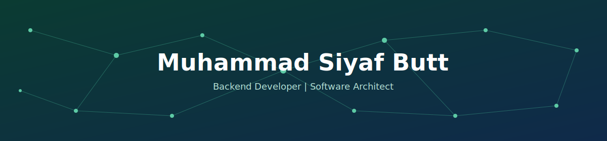
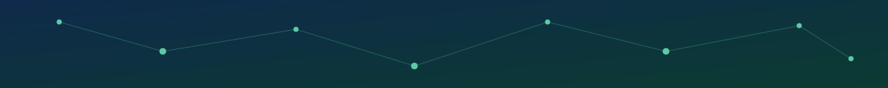

 

### About Me

Final-year BS Computer Science student at COMSATS University Islamabad, Abbottabad Campus. I design and build practical software systems — from Windows desktop applications with real hardware integration to secure, encrypted web platforms. Comfortable owning a project end-to-end: architecture, backend logic, and leading a team to ship it.

 

### Tech Stack

**Languages**

**Frameworks & Platforms**

**Data & Tools**

 

### Projects

<table>
<tr>
<td width="50%" valign="top">

**[DeviceSense](https://github.com/MuhammadSiyafButt/DeviceSense)** 🌟
Real-time Windows system-monitoring desktop app — Backend Lead & Architect on a 4-person team. Live hardware telemetry, AI diagnostics via Gemini API, custom LAN Admin module.
`C#` `.NET / WPF` `SQLite`

</td>
<td width="50%" valign="top">

**[file_sharing_system](https://github.com/MuhammadSiyafButt/file_sharing_system)**
Encrypted file sharing system with passwords stored in hash form.
`Python` `Flask`

</td>
</tr>
<tr>
<td width="50%" valign="top">

**[face_detection](https://github.com/MuhammadSiyafButt/face_detection)**
Face detection and recognition system.
`Python` `OpenCV`

</td>
<td width="50%" valign="top">

**[bus_portal](https://github.com/MuhammadSiyafButt/bus_portal)**
Bus booking and management portal.
`Java`

</td>
</tr>
<tr>
<td width="50%" valign="top">

**[snake_game_in_C-](https://github.com/MuhammadSiyafButt/snake_game_in_C-)**
Classic Snake game built from scratch.
`C++`

</td>
<td width="50%" valign="top">

**[personal_portfolio](https://github.com/MuhammadSiyafButt/personal_portfolio)**
Personal portfolio website.
`CSS`

</td>
</tr>
<tr>
<td width="50%" valign="top">

**[js_basic](https://github.com/MuhammadSiyafButt/js_basic)**
JavaScript fundamentals and practice.
`JavaScript`

</td>
<td width="50%" valign="top">

</td>
</tr>
</table>

 

*Open to backend, full-stack, and software architecture opportunities.*

